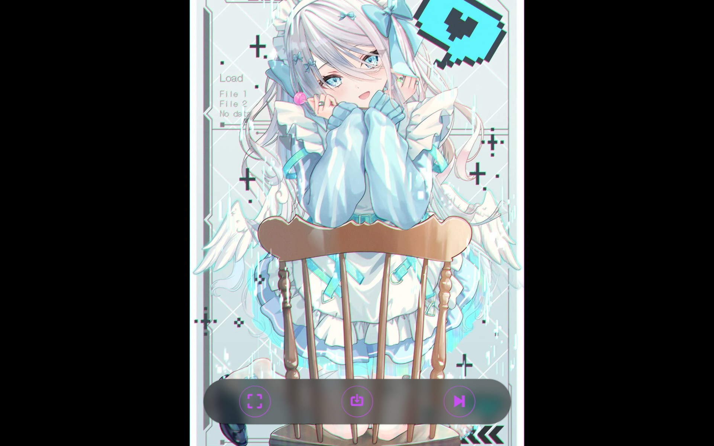
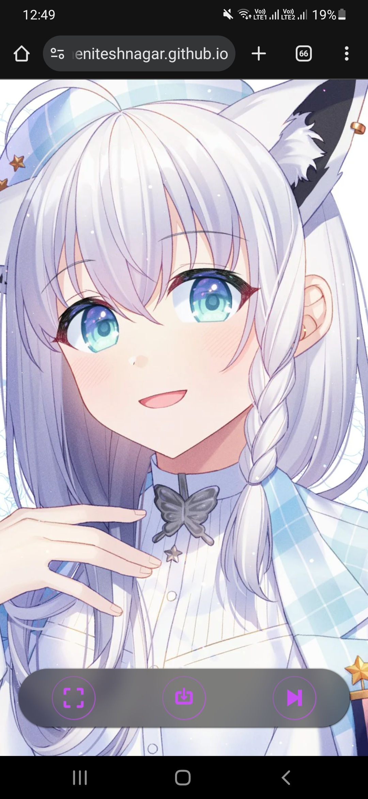
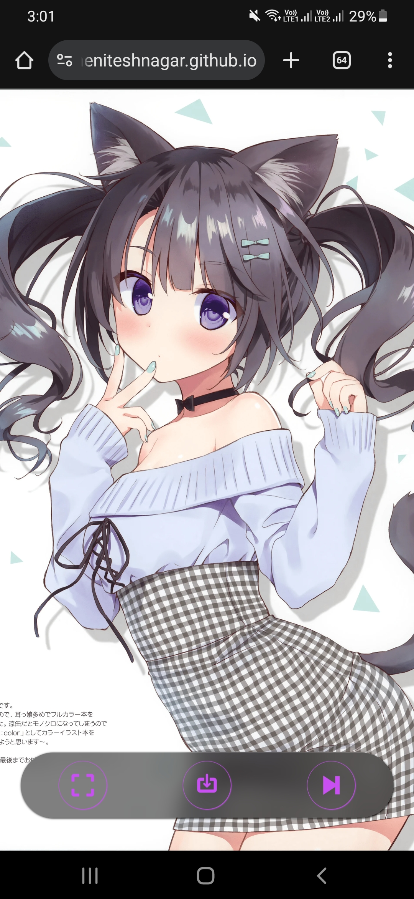
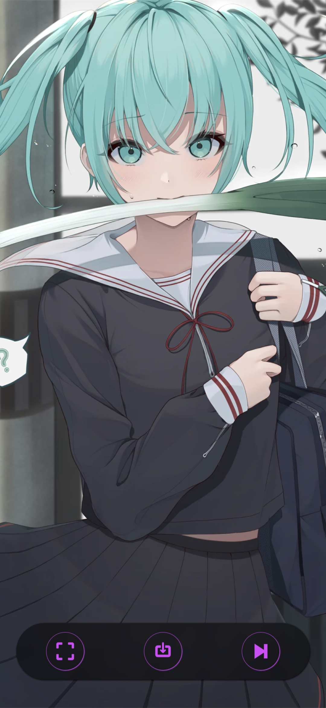

<div align="center">

# 🌸 Random Anime Wallpaper 🌸

*Your daily dose of kawaii wallpapers*

[](https://theniteshnagar.github.io/random-anime-wallpaper-html-css-js/)
[](LICENSE)


**Random anime wallpapers featuring waifus, husbandos, nekos & kitsunes** ✨  
Powered by [nekos.best API](https://nekos.best/)

</div>

## 🎯 Features

🎨 Random high-quality anime art • 📥 One-click download • 🖥️ Fullscreen mode  
⚡ Smart preloading • ⌨️ Keyboard shortcuts • 🎵 uwu Easter egg  
📱 Fully responsive • 🎌 Minimal & clean UI

## 📸 Preview

<div align="center">
  
  <br/>
  
  
  
</div>

## ⌨️ Shortcuts

| Key | Action |
|-----|--------|
| <kbd>Space</kbd> / <kbd>→</kbd> / <kbd>N</kbd> | Next wallpaper |
| <kbd>F</kbd> | Fullscreen |
| <kbd>D</kbd> | Download |
| <kbd>U</kbd> | uwu sound 🥚 |

## 🚀 Usage

**Live:** [theniteshnagar.github.io/random-anime-wallpaper-html-css-js](https://theniteshnagar.github.io/random-anime-wallpaper/)

**Local:**
```bash
git clone https://github.com/theniteshnagar/random-anime-wallpaper.git
cd random-anime-wallpaper
# Open index.html in browser
```

No build needed. Pure vanilla JS! 🍦

## 🛠️ Stack

HTML5 • CSS3 • Vanilla JavaScript • [nekos.best API](https://nekos.best/)

## 💡 How It Works

Fetches random anime images from 4 categories → Smart preloading in background → Smooth transitions with cached images → Download as blob with timestamp filename

---

<div align="center">

**Made with 💖 for anime fans**

*Happy wallpaper hunting, otaku!* 🎌

</div>
